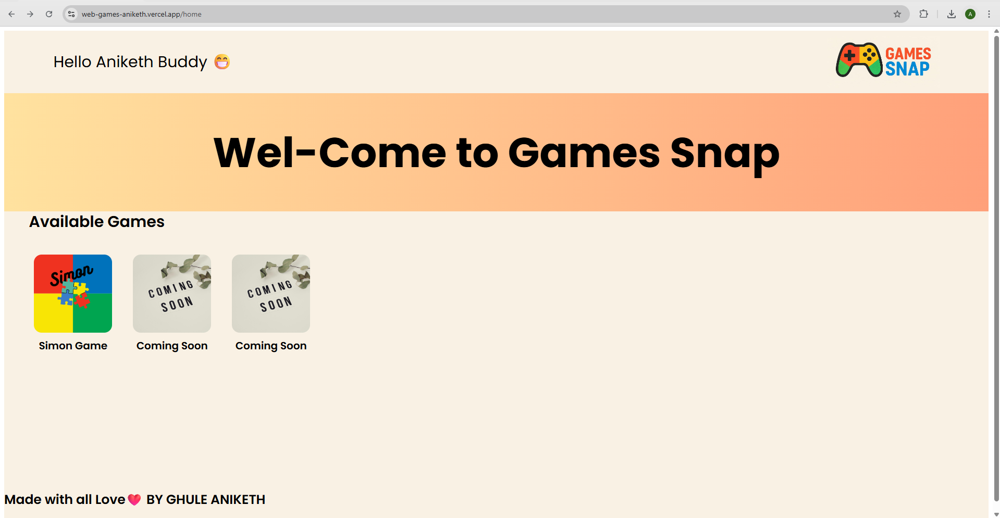
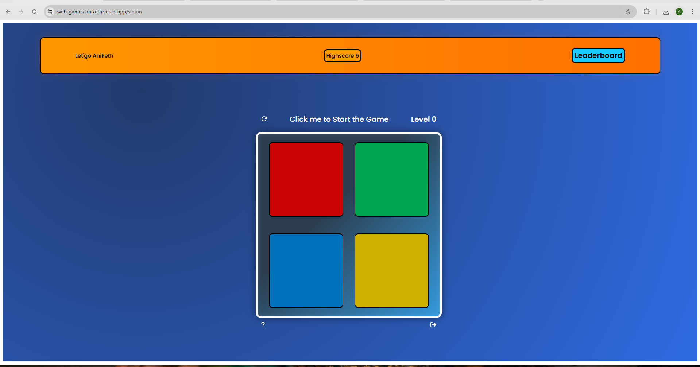

🎮 Web Games – A Collection of Fun Browser Games
Welcome to Web Games — a set of interactive, lightweight, and fun games you can play instantly in your browser.
No installation. No sign-up. Just click and play! 🚀

This project is built with Next.js, HTML5, CSS3, and JavaScript — combining modern web technologies with classic gameplay.

📸 Screenshots
Here are some previews of the games included:

✨ Features
✔ Multiple Games – All in a single platform.
✔ Responsive Design – Works seamlessly on desktop, tablet, and mobile.
✔ Attractive UI – Eye-catching gradients, animations, and interactive buttons.
✔ Lightweight & Fast – No lag, no long loading screens.
✔ Pure Fun – Great for quick breaks and casual gaming.

🎯 Games Included
Simon Says – Test your memory and focus with an addictive color sequence challenge.

(More mini-games coming soon...)

🚀 Play Now (Instant Access)
Click the link below to play instantly — no setup needed:
👉 Web Games Live

🛠 Tech Stack
Technology	Purpose
Next.js	Main framework for building the app
HTML5	Game structure and markup
CSS3	Styling, responsive layout, and animations
JavaScript (ES6)	Game logic and interactivity

📱 Mobile Friendly
The entire platform is designed with responsive CSS, ensuring you can play comfortably on:

📱 Phones

💻 Laptops

🖥 Desktops

📟 Tablets

📌 Future Roadmap
🔹 Add more games (e.g., Tic Tac Toe, Snake, and more).

🔹 Add sound effects & background music toggle.

🔹 Add leaderboard to track top scores.

🔹 Multiplayer support for certain games.
